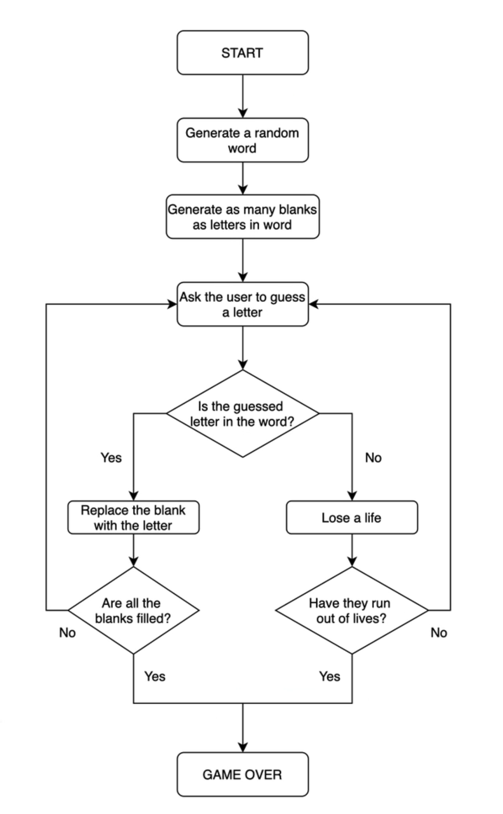

## Hangman

# Instructions
Day 7 splits a project into challenges to create a hangman.  
Use the flowchart [hangman_flowchart](hangman_flowchart.png) to solve the challenges to complete the hangman game.


# Challenge 1
Use the [ch01.py](ch01.py).

### TODO-1 
- Randomly choose a word from the word_list and assign it to a variable called chosen_word.

### TODO-2 
- Ask the user to guess a letter and assign their answer to a variable called guess. Make guess lowercase.
- Not part of the lecture, but you can make sure the user entered a single letter.

### TODO-3 
- Check if the letter the user guessed (guess) is one of the letters in the chosen_word.

## Output

```
Enter a letter:> 1
Please enter a single letter
Enter a letter:> paula
Please enter a single letter
Enter a letter:> a
Right
Right
Wrong
Wrong
Wrong
Right
Wrong
Wrong

```
OBS.: `>` represents input

# Challenge 2

Use the [ch02.py](ch02.py).

### TODO-1: 
- Create a List called display that for each letter in the chosen_word, add has an element "_" in it.
    - So if the chosen_word was "apple", display should be `["_", "_", "_", "_", "_"]` with 5 "_" representing each letter to guess.
    
### TODO-2:
- Loop through each position in the chosen_word;  
- If the letter at that position matches 'guess' then reveal that letter in the display at that position.  
  e.g. If the user guessed "p" and the chosen word was "apple", then display should be `["_", "p", "p", "_", "_"]`.


### TODO-3:
- Print 'display', and you should see the guessed letter in the correct position and every other letter replace with "_".
- **Hint**: Don't worry about getting the user to guess the next letter. We'll tackle that in step 3.

## Output 
```
Pssst, the solution is: aardvark.
['_', '_', '_', '_', '_', '_', '_', '_']
Enter a letter:> aardvark
Please enter a single letter!
Enter a letter:> 1
Please enter a single letter!
Enter a letter:> a
['a', 'a', '_', '_', '_', 'a', '_', '_']
```
OBS.: `>` represents input

# Challenge 3
Use [ch03.py](ch03.py).

### TODO-1:
- Use a while loop to let the user guess again.
- The loop should only stop once the user has guessed all the letters in the chosen_word and 'display' has no more blanks ("_"). Then you can tell the user they've won.


## Output

```
Enter a letter:> aardvark
Please enter a single letter!
Enter a letter:> a
['a', 'a', '_', '_', '_', 'a', '_', '_']
Enter a letter:> r
['a', 'a', 'r', '_', '_', 'a', 'r', '_']
Enter a letter:> d
['a', 'a', 'r', 'd', '_', 'a', 'r', '_']
Enter a letter:> v
['a', 'a', 'r', 'd', 'v', 'a', 'r', '_']
Enter a letter:> k
['a', 'a', 'r', 'd', 'v', 'a', 'r', 'k']
You win!
```
OBS.: `>` represents input

# Challenge 4
Use [ch04.py](ch04.py).

### TODO-1:
- Create a variable called 'lives' to keep track of the number of lives left.
- Set 'lives' to equal 6.

### TODO-2:
- If guess is not a letter in the chosen_word, then reduce 'lives' by 1.
- If lives goes down to 0 then the game should stop, and it should print "You lose."
- Join all the elements in the list and turn it into a String.


### TODO-3:
- print the ASCII art from 'stages' that corresponds to the current number of 'lives' the user has remaining.

## Output

```
Pssst, the solution is aardvark.
Enter a letter:> 1
Please enter a single letter!
Enter a letter:> aardvark
Please enter a single letter!
Enter a letter:> p
_ _ _ _ _ _ _ _

  +---+
  |   |
  O   |
      |
      |
      |
=========
Enter a letter:> a
a a _ _ _ a _ _

  +---+
  |   |
  O   |
      |
      |
      |
=========
Enter a letter:> u
a a _ _ _ a _ _

  +---+
  |   |
  O   |
  |   |
      |
      |
=========
Enter a letter:> l
a a _ _ _ a _ _

  +---+
  |   |
  O   |
 /|   |
      |
      |
=========
Enter a letter:> a
a a _ _ _ a _ _

  +---+
  |   |
  O   |
 /|   |
      |
      |
=========
Enter a letter:> u
a a _ _ _ a _ _

  +---+
  |   |
  O   |
 /|\  |
      |
      |
=========
Enter a letter:> y
a a _ _ _ a _ _

  +---+
  |   |
  O   |
 /|\  |
 /    |
      |
=========
Enter a letter:> v
a a _ _ v a _ _

  +---+
  |   |
  O   |
 /|\  |
 /    |
      |
=========
Enter a letter:> r
a a r _ v a r _

  +---+
  |   |
  O   |
 /|\  |
 /    |
      |
=========
Enter a letter:> k
a a r _ v a r k

  +---+
  |   |
  O   |
 /|\  |
 /    |
      |
=========
Enter a letter:> d
a a r d v a r k

  +---+
  |   |
  O   |
 /|\  |
 /    |
      |
=========
You win!
```
```
Pssst, the solution is aardvark.
Enter a letter:> 1
Please enter a single letter!
Enter a letter:> aardvark
Please enter a single letter!
Enter a letter:> p
_ _ _ _ _ _ _ _

  +---+
  |   |
  O   |
      |
      |
      |
=========
Enter a letter:> a
a a _ _ _ a _ _

  +---+
  |   |
  O   |
      |
      |
      |
=========
Enter a letter:> u
a a _ _ _ a _ _

  +---+
  |   |
  O   |
  |   |
      |
      |
=========
Enter a letter:> l
a a _ _ _ a _ _

  +---+
  |   |
  O   |
 /|   |
      |
      |
=========
Enter a letter:> a
a a _ _ _ a _ _

  +---+
  |   |
  O   |
 /|   |
      |
      |
=========
Enter a letter:> u
a a _ _ _ a _ _

  +---+
  |   |
  O   |
 /|\  |
      |
      |
=========
Enter a letter:> y
a a _ _ _ a _ _

  +---+
  |   |
  O   |
 /|\  |
 /    |
      |
=========
Enter a letter:> v
a a _ _ v a _ _

  +---+
  |   |
  O   |
 /|\  |
 /    |
      |
=========
Enter a letter:> r
a a r _ v a r _

  +---+
  |   |
  O   |
 /|\  |
 /    |
      |
=========
Enter a letter:> k
a a r _ v a r k

  +---+
  |   |
  O   |
 /|\  |
 /    |
      |
=========
Enter a letter:> z
a a r _ v a r k

  +---+
  |   |
  O   |
 /|\  |
 / \  |
      |
=========
You lose!
```
OBS.: `>` represents input

