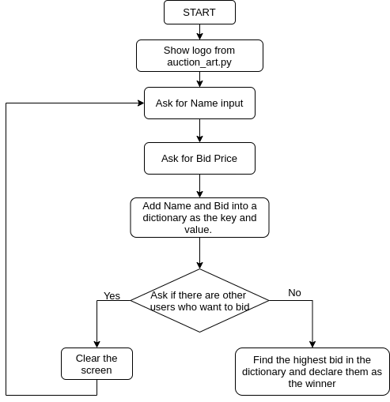

# Secret Auction

# Instructions
Follow the [flowchart](flowchart.png):


# Example Output

```

                         ___________
                         \         /
                          )_______(
                          |"""""""|_.-._,.---------.,_.-._
                          |       | | |               | | ''-.
                          |       |_| |_             _| |_..-'
                          |_______| '-' `'---------'` '-'
                          )"""""""(
                         /_________\\
                       .-------------.
                      /_______________\\

What is your name?> Paula
What is your bid? $ > 100.99
Are there any other bidders? Type 'yes' or 'no'.
> yes
```
```

                         ___________
                         \         /
                          )_______(
                          |"""""""|_.-._,.---------.,_.-._
                          |       | | |               | | ''-.
                          |       |_| |_             _| |_..-'
                          |_______| '-' `'---------'` '-'
                          )"""""""(
                         /_________\\
                       .-------------.
                      /_______________\\

What is your name?> Anna
What is your bid? $ > 50.50
Are there any other bidders? Type 'yes' or 'no'.
> no
```
```
The highest bid is $100.99 and it was made by Paula
```
OBS.: `>` represents input
