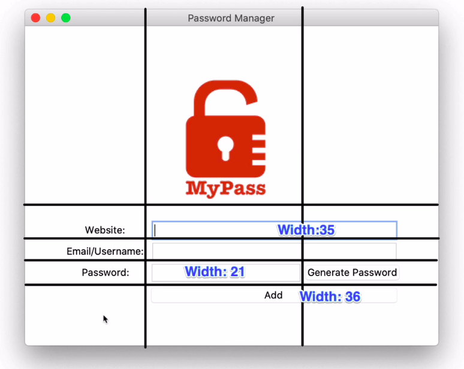

# Password Manager

## Instructions

Using Tkinter create a password manager.
The following steps can be considered **challenges**:

OBS.: You may have to use different values in your program
1. Configure the window like the following image:

   
2. Configure the widgets, so the window looks like the following image: 

3. Save the data to the [passwords.csv](passwords.csv) file and delete the filled entries.

4. Create a popup that asks the user if he is sure he wants to add the data to the csv file. 

5. Create a popup that inform the user if he left any field empty.  

6. Use the project of day 5 to generate a password when he clicks the button **generate password**

7. Add a functionality to auto copy the password generated to the clipboard.
