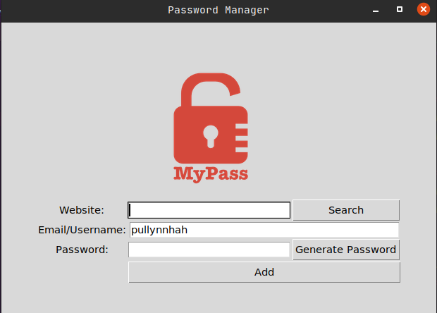

# Password Manager Improvements

## Instructions

Improve the code of the Password Manager Project in Day029, so it handles exceptions.
Also, add the functionality to search for a password.

1. Add a "Search" button next to the website entry field.
2. Adjust the layout, and the other widgets as needed to get the desired look.

3. Create a function called `search()` that gets triggered when the "Search" button is pressed.
4. Check if the user's text entry matches an item in the `data.json`.
5. If yes, show a messagebox with the website's name and password.
6. Catch an exception that might occur trying to access the `data.json` showing a messagebox with the text `"No Data File Found"`.
7. If the user's website does not exist inside `data.json`, show a messagebox that reads: `"No details for the website exists."`
