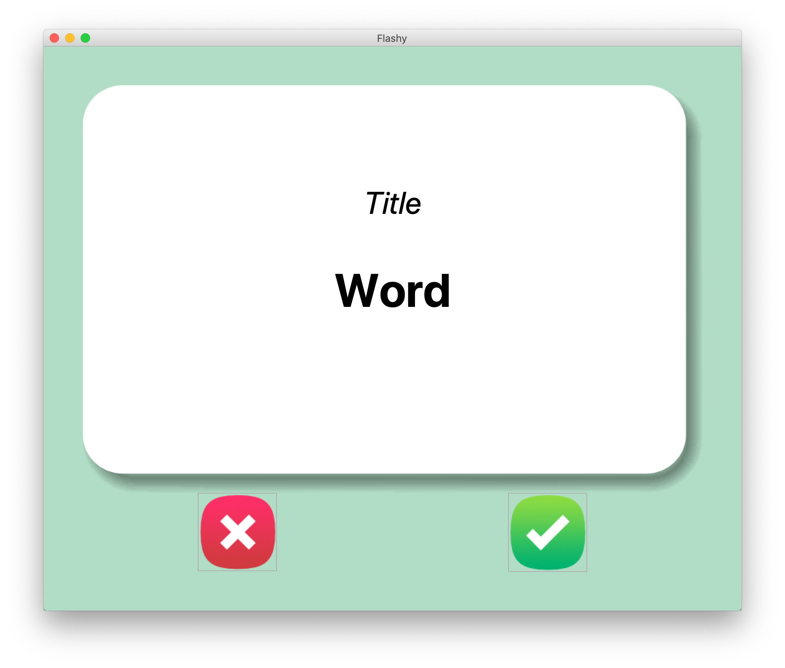
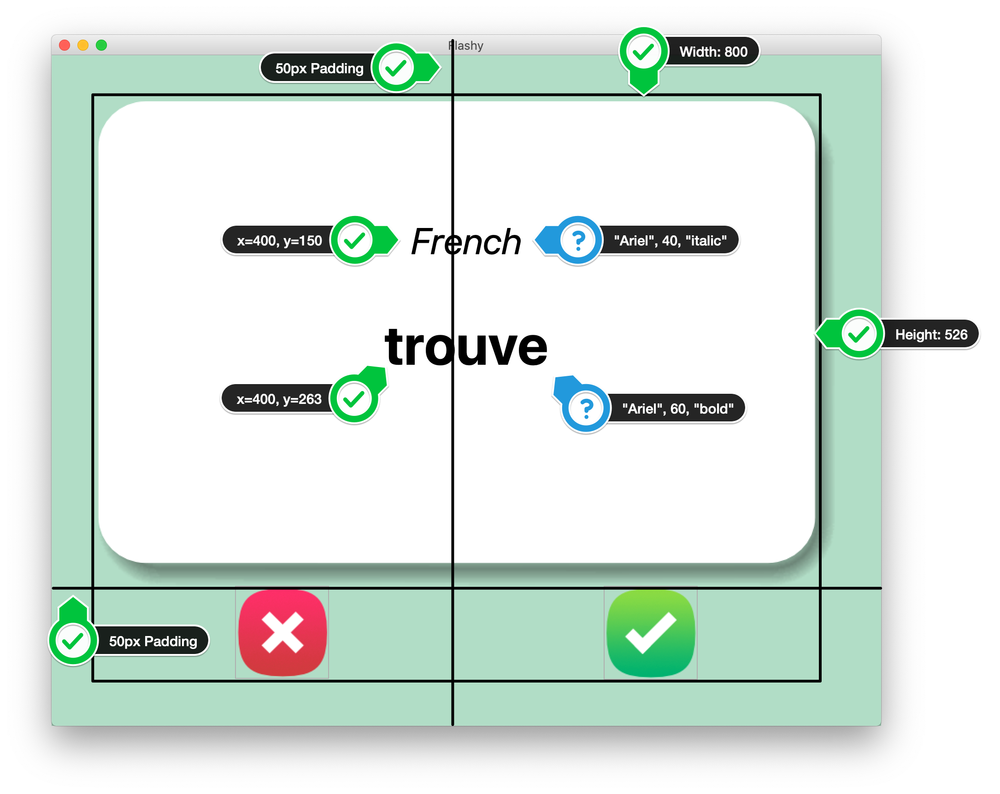
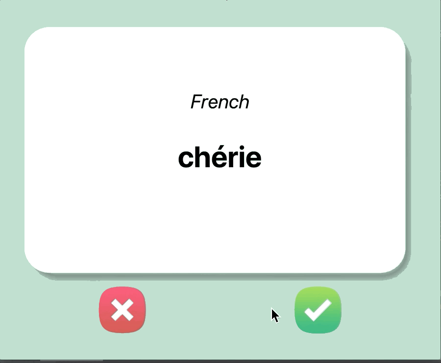

# Flashcard

# Instructions
## Step 1
- Create the User Interface (UI) with Tkinter
1. Download the starting files from the course resources.

2. Use the images in the image folder, to create the following user interface. The ❌ and ✅ are buttons. You can add images to buttons like this:

```python
my_image = PhotoImage(file="path/to/image_file.png")
button = Button(image=my_image, highlightthickness=0)
```


3. Here are some hints for the fonts, measurements and positioning.


### HINTS:

1. You will need a 2 X 2 grid, with the flash card taking up 2 columns.

2. The flashcard is a Canvas with 1 image and 2 pieces of text.

3. The image is card_front.png, created from the PhotoImage class. Be careful about the full image path as the image is inside the image folder.

## Step 2
- Create New Flash Cards
1. Read the data from the `french_words.csv` file in the data folder.

2. Pick a random French word/translation and put the word into the flashcard. Every time you press the ❌ or ✅ buttons, it should generate a new random word to display. e.g.


###HINT:

1. You'll need to use pandas to access the CSV file and generate a data frame. To get all the words/translation rows out as a list of dictionaries e.g.
```python
   [{french_word: english_word}, {french_word2: english_word2}, {french_word3: english_word3}]
```
You could use:
```python
DataFrame.to_dict(orient="records")
```
Documentation: [pandas](https://pandas.pydata.org/pandas-docs/stable/reference/api/pandas.DataFrame.to_dict.html)

## Step 3
- Flip the Cards!
1. After a delay of 3s (3000ms), the card should flip and display the English translation for the current word.

2. The card image should change to the card_back.png and the text colour should change to white. The title of the card should change to "English" from "French".


### HINTS:

1. To change the canvas image, you'll need a reference to the image, like what you have with the text created in the canvas. Then you can set the image attribute using itemconfig(). e.g.

new_image = PhotoImage(file="new_image.png")
old_image = PhotoImage(file="old_image.png")
canvas_image = canvas.create_image(300, 300, image=old_image)
### To change the image:
canvas.itemconfig(canvas_image, image=new_image)
**IMPORTANT:** PhotoImage objects should not be created inside a function. Otherwise, it will not work.

2. To change the color of the text in a canvas element, use the fill parameter. e.g. https://stackoverflow.com/questions/41030973/how-can-i-change-the-color-of-text-in-tkinter

3. Remember in the mainloop() you should not create additional delayed loops e.g. with time.sleep() but instead use window.after() e.g. [Tkinter Doc](https://docs.python.org/3/library/tkinter.html)

4. You can cancel a window.after() loop using window.after_cancel() e.g. [Tkinter](https://docs.python.org/3/library/tkinter.html)

## Step 4 
- Save Your Progress
1. When the user presses on the ✅ button, it means that they know the current word on the flashcard and that word should be removed from the list of words that might come up.

e.g. If french_words.csv had only 3 records:

```
chaque,each
parlé,speak
arrivé,come
```
After the user has seen `parlé,speak` it should be removed from the list of words that can come up again.

2. The updated data should be saved to a new file called words_to_learn.csv

e.g. words_to_learn.csv

chaque,each
arrivé,come
3. The next time the program is run, it should check if there is a words_to_learn.csv file. If it exists, the program should use those words to put on the flashcards. If the words_to_learn.csv does not exist (i.e., the first time the program is run), then it should use the words in the `french_words.csv`

We want our flashcard program to only test us on things we don't know. So if the user presses the ✅ button, that means the current card should not come up again.

e.g.


### HINTS:

1. The remove() method can remove elements from a list. e.g. https://www.w3schools.com/python/ref_list_remove.asp

2. You can create a new csv file from a dictionary using DataFrame.to_csv() e.g. https://pandas.pydata.org/pandas-docs/stable/reference/api/pandas.DataFrame.to_csv.html

3. If you don't want to create an index for the new csv, you can set the index parameter to False. e.g.
   
`data.to_csv("filename.csv", index=False)`
