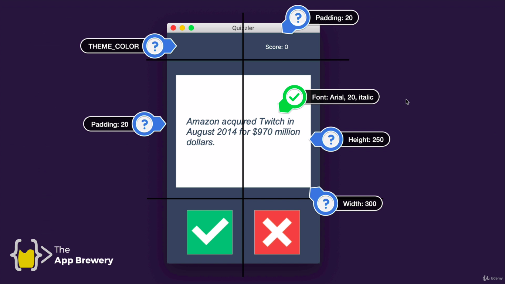

# Project name

# Instructions
1. Change the `data.py` file, so it gets 10 questions from the API [Trivia Database]()
   
2. Unescape the HTML entities, so the questions are more readable. To do that make changes  
on`quiz_brain.py` file.

```python
import html

html_text = "Some HTML code"
questions = html.unescape(html_text)
```

3. Create the `QuizInterface` class in the `ui.py` file. Use the image below as a guider.

   
4. Change the `QuizBrain` class, so that the method `next_question()` returns a string  
with the question to be asked instead of inputting it, in the console.

5. Create two new methods that you can add as a command to the buttons. The methods need to call `check_answer()` from the `quiz` and pass over the string "True" or "False". This should print some feedback to the console.

6. Change the canvas' background colour to green if the `is_correct` is True, and change it to red if it is False.

7. When a button has been pressed display the next question after 1000 milliseconds, but make sure to change the background back to white.
