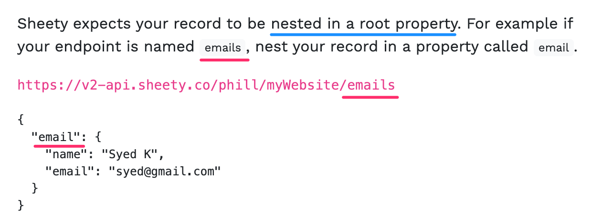

# Workout Tracking

## Step 1 
- Setup API Credentials and Google Spreadsheet

1. Go to this [link](https://docs.google.com/spreadsheets/d/1DHL6Y8XAHSC_KhJsa9QMekwP8b4YheWZY_sxlH3i494/edit?usp=sharing) and create a copy of the 'My Workouts Spreadsheet'. You may need to login/register.
2. Go to the [Nutritionix API website](https://www.nutritionix.com/business/api) and select "Get Your API Key" to sign up for a free account.
3. Once logged in, you should be able to access your API key and App id.
4. In the `project.py` file create 2 constants to store the `APP_ID` and `API_KEY` that you got from Nutritionix. 
   1. I'm going to use Environment variables instead of the actual key and id values to protect my data.

## Step 2

### FILE: [project01.py](project01.py)
- Get Exercise Stats with Natural Language Queries
1. Using the Nutritionix "Natural Language for Exercise" API Documentation, figure out how to print the exercise stats for a plain text input.

###HINT 1:
Use what you have learnt about Authentication headers and the relevant part of the [Nutritionix Authentication Documentation](https://docs.google.com/document/d/1_q-K-ObMTZvO0qUEAxROrN3bwMujwAN25sLHwJzliK0/edit#heading=h.gz6pu9o7f9iz) to authenticate your request.

### HINT 2:
Use what you have learnt about making POST requests and the relevant part of the [Nutritionix Exercise Documentation](https://docs.google.com/document/d/1_q-K-ObMTZvO0qUEAxROrN3bwMujwAN25sLHwJzliK0/edit#heading=h.zhjgcprrgvim) to make your request with the required parameters.

## Step 3 
- Setup Your Google Sheet with Sheety.
1. Log into Sheety with your Google Account (the same account that owns the Google Sheet you copied in step 1).
   1. Make sure the email matches between your Google Sheet and Sheety Account.
2. In your project page, click on "New Project" and create a new project in Sheety with the name "Workout Tracking" and paste in the URL of your own "My Workouts" Google Sheet.
3. Sync your Google Sheet in Sheety by clicking on the "Sync" button.
4. Click on the workouts API endpoint and check the boxes next to GET and POST.

## Step 4 
### FILE: [project02.py](project02.py)
- Saving Data into Google Sheets
1.  Using the [Sheety Documentation](https://sheety.co/docs/requests), write some code to use the Sheety API to generate a new row of data in your Google Sheet for each of the exercises that you get back from the Nutritionix API. The date and time columns should contain the current date and time from the Python datetime module.

### HINT 1:
Parameters have to be lower case. Also, pay special attention to this part in the documentation:

### HINT 2:
Remember you can generate text in title case by using the Python `.title()` method.[https://www.w3schools.com/python/ref_string_title.asp](https://www.w3schools.com/python/ref_string_title.asp)

### HINT 3:
Remember you can format a datetime object using the `.strftime()` method.[https://www.w3schools.com/python/python_datetime.asp](https://www.w3schools.com/python/python_datetime.asp)

## Step 5 
- Authenticate Your Sheety API
At the moment there is no authentication that's required to access your Sheety endpoint. That means anyone could read and write to your "My Workout" Google Sheet.
1. Add either "Basic Authentication" or "Bearer Token" to your Sheety endpoint to secure it. 

Basic Authentication: [requests doc](https://requests.readthedocs.io/en/master/user/authentication/#basic-authentication)

Bearer Authentication: [stackoverflow](https://stackoverflow.com/questions/29931671/making-an-api-call-in-python-with-an-api-that-requires-a-bearer-token)

## Step 6
### LINK [repl.it](https://repl.it/@ppbueno/Workout-Tracker#main.py)
- Environment Variables in Repl.it
In order to be able to post our workout data while we're out and about, it would be easier if we can access the console and run the code in Repl.it

However, because Repl.it is open source, we don't want other people to see our API keys and secrets.

1. Using what you know about Environment Variables, update your code to use environment variables for all sensitive data including:

`API_ID`

`API_KEY`

`SHEETY_ENDPOINT`

`SHEETY_TOKEN`

2. Use the Repl.it documentation to work out how to create a `.env` file in Repl.it and store your Environment Variables in there.

[repl.it](https://docs.repl.it/repls/secret-keys#:~:text=env%20files%20are%20used%20for,see%20the%20contents%20of%20the%20).

### HINT 1:
Environment variables are declared without spaces!

###HINT 2:
[stackoverflow](//https://stackoverflow.com/questions/4906977/how-to-access-environment-variable-values)
