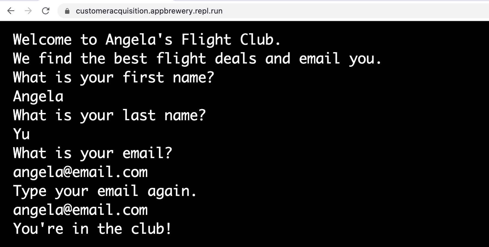
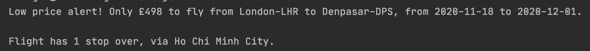

# Flight Club - Capstone Part  2

## Step 1
### LINK: [repl.it](https://repl.it/@ppbueno/Flight-Club-Member-Adding#main.py)
- Create the Customer Acquisition Code

- In order for other users to access our customer acquisition program, we're going to use repl.it to host our code and share the link to the console with our users.
    - I'm going to write the code in PyCharm and then, when the project is really, I'll post a copy to repl.it

1. Create a new Sheet (Tab) in your Copy of Flight Deals Google Sheet.

2. Add 3 new column headings - "First Name", "Last Name", "Email" to this new user Sheet:

3. Sync the new sheet in Sheety. Note: you might have to log in again to Sheety, also you'll need to re-check the PUT checkbox in the prices endpoint.

4. Enable the POST method in the users endpoint

5. Code up the project so that it asks the user for their first name, last name and email. Make sure to get them to type their email twice for validation. If the two emails match, then tell them that they're in the club. e.g.
   

6. Use the Sheety API to POST the data that the user enters into the user sheet in your Copy of Flight Deals Google Sheet.

## Step 2
- Download the Starting Project

Head over to the link below to download the completed code for the flight deals project that we created yesterday and open it in PyCharm:

[https://repl.it/@appbrewery/flight-deals-end.zip](https://repl.it/@appbrewery/flight-deals-end.zip)

Remember to replace the relevant parts (eg. API Keys and Sheet endpoints) with your own.

Alternatively, you can use your own code from yesterday, make sure that it has all of the required functionality. If in doubt, review the code from yesterday's completed project.

## Step 3
- Exception Handling for Destinations without Flights

For some destinations, certain time periods, there will be no flights available. We need to add exception handling to our code so that it doesn't break and crash in these situations.

1. Add Bali, DPS, 501 to the last row of the prices sheet in your copy of the Flight Deals Google Sheet.

NOTE: Bali is not a city, but the city in Bali with the largest airport is not well known to most people (Denpasar). To find the historic low price, I used this website: https://www.faredetective.com/farehistory/

2. Run your program, and it will crash, we've set the max_stopovers to 0 and there are no direct flights from London to Denpasar (Bali). Use exception handling to prevent this. You'll need to use try/except/else to catch the situations when the flight data is empty and let the code continue without crashing.
    1. I had this problem with the code in Day039, and I used a basic if statement to solve it. So my code doesn't give an error if a flight for some destination doesn't exist.

HINT: if the flight data is empty, you'll return an empty flight object (None) to main.py you can use continue to let the for loop to continue to run when flight is None. https://www.w3schools.com/python/ref_keyword_continue.asp

## Step 4 
- Destinations without Direct Flights

There are a lot of popular destinations that our customers will want to go to that don't have direct flights. e.g. Bali

1. If a flight is not found, check to see if there are flights with 1 stop and pretty print the result with pprint(). FILE: [project01.py](project01.py)

2. Modify the FlightData class to add 2 optional init parameters with default values - `stop_overs=0` and `via_city=""` . Instead of the printing the result from (1.) above, create a flight object with `stop_overs` set to 1 and `via_city` as the name of stop over city. Examine the data you printed in (1.) carefully to extract the information for origin_city, origin_airport, destination_city, destination_airport, out_date, and return_date .
    1. Again, the way I wrote my code the user passes the parameters to the init as a dictionary, so the only change is to add those keys to the dictionary being passed.
    2. Also, the way I structure my FlightData class it receives the data attribute of a FlightSearch object, so it will already have away of accessing the `via_city` attribute without passing as an argument implicitly.

HINT: the "route" key value pair you get back from the API now contains a list with 4 items. 
`[origin -> stop_over, stop_over -> destination, destination -> stop_over, stop_over -> origin]`.

3. Format the message to the NotificationManager in main.py to add the stop_over number and via_city, if a flight is found that requires a stop over.

e.g. It should read:

Step 5 - Email all our customers
Now that our program is working as expected, all that's left to do is to notify our customers when there is a good deal!

1. Create a method in the NotificationManager called send_emails() . Use what you have learnt about smtplib and sending emails to send all our customers in the users sheet from Google Sheets the message that contains the flight deal.

NOTE: when sending emails, it won't like the "£" symbol, you might get an error like the one below:

You can solve this by encoding the message with UTF-8 e.g.[stackoverflow]( https://stackoverflow.com/questions/9942594/unicodeencodeerror-ascii-codec-cant-encode-character-u-xa0-in-position-20#answer-9942885)

2. You can generate a Google Flight link with all the information pre-populated so that users can book the flights by clicking on the link in the email.

e.g. This is the Google flight link for a flight from STN to SXF from 2020-08-25 to 2020-09-08.

[google flight](https://www.google.co.uk/flights?hl=en#flt=STN.SXF.2020-08-25*SXF.STN.2020-09-08)

Figure out who part of the URL needs to be replaced and construct a URL when for any cheap flights. Send this URL along with the message when you email your customers.
